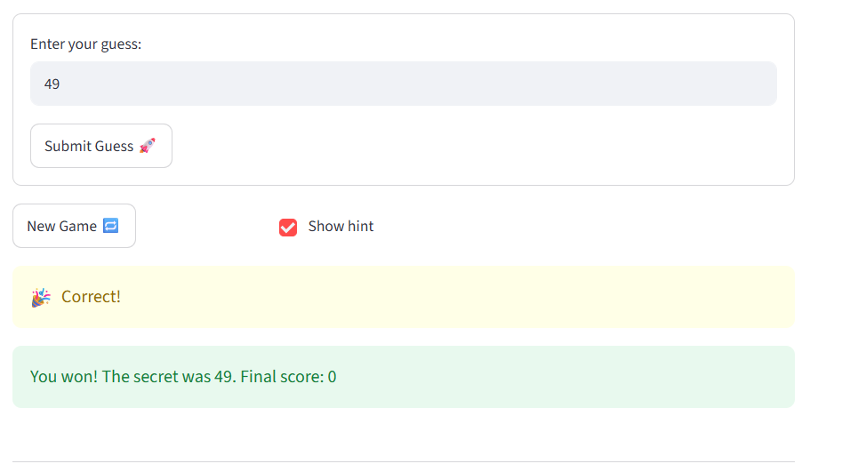

# 🎮 Game Glitch Investigator: The Impossible Guesser

## 🚨 The Situation

You asked an AI to build a simple "Number Guessing Game" using Streamlit.
It wrote the code, ran away, and now the game is unplayable. 

- You can't win.
- The hints lie to you.
- The secret number seems to have commitment issues.

## 🛠️ Setup

1. Install dependencies: `pip install -r requirements.txt`
2. Run the broken app: `python -m streamlit run app.py`

## 🕵️‍♂️ Your Mission

1. **Play the game.** Open the "Developer Debug Info" tab in the app to see the secret number. Try to win.
2. **Find the State Bug.** Why does the secret number change every time you click "Submit"? Ask ChatGPT: *"How do I keep a variable from resetting in Streamlit when I click a button?"*
3. **Fix the Logic.** The hints ("Higher/Lower") are wrong. Fix them.
4. **Refactor & Test.** - Move the logic into `logic_utils.py`.
   - Run `pytest` in your terminal.
   - Keep fixing until all tests pass!

## 📝 Document Your Experience

- [ ] Describe the game's purpose.
The purpose is for the user to guess the number and change their guess based on what the hint says
- [ ] Detail which bugs you found.
I made is so that you can hit enter to submit. I changed the hints, and I made is so you cannot submit outside the range. 
New game button did not restart the game. 
- [ ] Explain what fixes you applied.
I had to change various funtions. For example I had to change the logic of the hints so that it match with go higher or go lower. I also had to change the logic of hitting the enter button and what was a valid or not valid guess. I also had to make it so that the state of the game updated when the new game button was hit. Other wise it would not restart. 

## 📸 Demo Walkthrough

Describe your fixed game in numbered steps so a reader can follow along without watching a video:

1. User enters a guess of 75
2. Game returns "Go Lower"
3. User enters a guess of 40 = "Go Higher"
4. Score updates correctly after each guess
5. Game ends after the correct guess

**Screenshot** *(optional)*: 

## 🧪 Test Results

```
# Paste your pytest output here, e.g.:
# pytest tests/
# ========================= 28 passed in 0.11s =========================

## 🚀 Stretch Features

- [ ] [If you choose to complete Challenge 4, describe the Enhanced UI changes here — a screenshot is optional]

## 🎨 UI Enhancements

I added user-facing improvements in `app.py` to make the game feel modern and readable while keeping the core game logic in `logic_utils.py` unchanged.

- **Modern styling:** the app now uses custom CSS for a soft gradient background and a rounded summary card. This is defined at the top of `app.py` and improves the look without changing game behavior.
- **Structured session summary:** a new helper function, `render_session_summary(history)`, renders a guess history table after each submit using `st.table()` and a `pandas.DataFrame` when available.
- **Color-coded feedback:** the submit flow now shows hints using Streamlit styling:
   - `Win` -> `st.success()`
   - `Too High` -> `st.error()`
   - `Too Low` -> `st.info()`
  This is implemented in the submit handling block in `app.py`.
- **Summary card:** each guess displays a modern summary card with `Last guess`, `Outcome`, and `Attempt` details.

Which files were changed:
- `app.py` — improved UI and structured output, including the new `render_session_summary()` helper and the summary card display.
- `README.md` — documented the UI enhancements and referenced the relevant functions and app behavior.

These changes keep the core logic in `logic_utils.py` intact, so the primary game rules and scoring remain unchanged.
